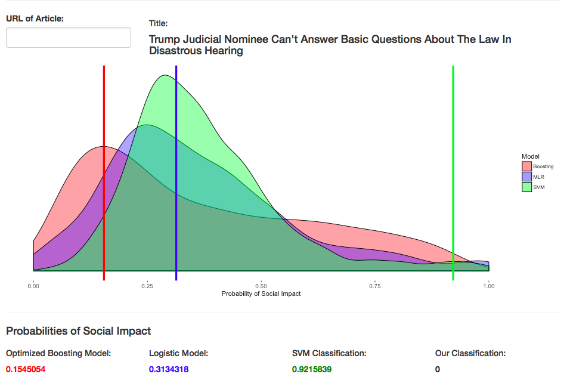

# Introduction

Our team used articles from a major online news publication and tried to create a tool that could automatically classify socially impactful articles from those that are not based on several aspects of the article. These aspects included the article’s presence in social media (e.g. number of likes, shares, etc.), level of readability and the sentiments associated with the words used.

We define socially impactful articles as those that change the readers’ way of thinking. It can also bring someone to take action or change the way they act. Even if it does not make them change their views, if the article leaves an impression or makes readers think it can also be a socially impactful article as well. Therefore, some impacts that the article can have on readers are changing the way they think, leaving an impression, or reaffirming their ideas. It could also make readers change their habits or actions based on what they have read. These definitions were condensed into a flowchart that was used for future classification (as seen below). 

#Pre-existing Data
The data for this project were provided by the online news source which contained information for their top 10000 most-viewed articles. This news source collects and calculates data on many variables such as page views, returning visitors, and social interactions for each of their articles. The dataset given to us included 33 variables, the majority of which were numeric. To understand these metrics, we referred to the company’s application programming interface (API) which contained a description of 21 metrics. The API can be found at this address: [https://www.parse.ly/help/api/available-metrics/](https://www.parse.ly/help/api/available-metrics/). 

Other numeric metrics not included in this API were average views for returning and new visitors, as well as direct, other, internal, and search referrals. Direct referrals are a count of ...

The final six variables included the URL, title, publish date, author(s), section, and tags. Example of tags are ‘ads_scary’ and 'health_depression'. Some sections include ‘Crime’, ‘Comedy’, ‘Entertainment’, and ‘Politics’.

## Descriptive Statistics
For this entire dataset of 10,000 observations, the average numbers of page views was 105904.9. The average number of social interactions was 12957.97. An average of 77584.06 engaged minutes were spent on each article. The top three sections were Politics (27.94% of articles), Entertainment (18.62 %), and Comedy (4.86%). 

## Subsetting our Data
While initially defining social impact, we discovered the difficulty of comparing articles from different sections. For example, an article from the entertainment section would never seem socially impactful when compared to an article from a section like "Black Voices." 

Existing literature also indicates that text mining models perform better when they are domain-specific and that it is difficult to compare results across different domains.

We decided that this project needed to start with only one section. The section chosen was politics because it had the highest number of articles which was 2,794.

#Collection of Additional Data

## Text Mining

We realized that all of our existing data tell us about the social media reach of a given article. However, one of the problems specified by our client was that social media reach is oftentimes not a good indicator of whether the article is socially impactful or not. In order to add another dimension to our data, we decided to retrieve the text of the articles from the URLs that were provided to us in the dataset. 

We wrote a Python script that takes in the URL as input and scrapes the webpage to retrieve the text. We used the BeautifulSoup package in Python for this purpose. 

# Incorporating Natural Language Processing Statistics

We decided to supplement the social media statistics we got from our client with some basic text mining statistics that give us some information about the text. As discussed earlier, since the task at hand is to judge the impact of the articles, we made the assumption that there would be some relationship between the text itself and the impact it creates. 

We wrote a script in Python for this purpose using the textstat Python package.The script takes as input the text of the articles (obtained from the parser) and outputs the computed statistics. Specifically, we calculate the following five statistics: 

1. word_count: This calculates the number of words in the text.
2. sentence_count: This calculates the number of sentences in the text.
3. readability_score: This calculates the Flesch Reading Ease Score which is helpful to access the ease of readability in a document and ranges from 0 to 100 where 0 is difficult to read and 100 is easy to read.
4. grade_level: This is calculated using the Automated Readability Index which outputs a number that approximates the grade level needed to comprehend the given text. This ranges from 1 to 12. 
5. smog_index: This calculates the a statistics called Simple Measure of Gobbledygook for the given text. In simple terms, smog index calculates the difficulty level of a sentences based on the number of words that are polysyllabic. It ranges from 5 to 22 which corresponds to the age of the reader who can understand the given text. 

## Article Classification
In order to run supervised learning models, we needed to populate the response variable (Impact) to create the training set. Thus, we decided to use Amazon Mechanical Turk (MTurk) for data collection to ensure the classifcation of articles were random. MTurk is a crowdsourcing internet marketplace where “Requesters” create tasks that require human intelligence and “Workers” are paid upon successful completion of each task also known as HITs (Human Intelligence Tasks). 

As requesters, we launched tasks that provided a hyperlink to an article and the flow chart shown in Figure 1. For each HIT the workers were asked to click the hyperlink to be directed to the article, read the article, and classify the articles after following the given flow chart. We launched 2500 articles and requested 3 iterations of each article. Thus, we had a total of 7500 HITs. Upon data collection, analysis of the 7500 HITs was conducted. We conducted a Pearson correlation test of association between paired samples of the three iteration. The results of the test indicated that none of the interactions were statistically significantly correlated to one another (p-value > 0.05). Due to the low correlation value of iterantions, another analysis was conducted to test whether the data was indistiguishable from random data. We conducted a test of significant difference between two independent correlations of random impuation of the classifcation of articles to the three iterations. The results indated that there were no statistically significant difference between random impuation data and the data collected through MTurk (p-value > 0.05). 

Following the results of the first MTurk, we launched another set of tasks that provided the parsed text of the article and same flow chart from the previous task. For each HIT the workers were asked to read the parsed text, summarize the text in two to five sentences, and classify the articles after following the given flow chart. This time, we launched 500 articles with 3 iterations of each articles. Thus, we had a total 1500 HITs. The results of the data collection had 97% of the articles rated as socially impactful. The results of the secound MTurk data was not realistic to our understanding of social impact, and would have not been a ideal data for training set (as any classificiation model will predict everything as impactful). Thus, this data was discarded as well. 

Finally, the data collection was conducted by our group members going through each articles and classifying the articles ourselves following the flow chart we created. We classified a total of 1300 articles and used these 1300 articles as the training set.

#Data Cleaning

Once the NLP and sentiment analysis was completed, the original traffic data of each article and the new NLP and sentiment analysis as well as the social impact classification outcome were compiled together. In order to build supervised learning models, only numerical vectors were selected for data analysis. Thus variables such as `Tags`, `Published_Date`, `Author` and the parsed `Text` was removed. However we kept `URL` and `Title` variables, but those were not included in the models. Additionally, six duplicated rows were removed. 

##Missing Data
There were a few missing entries in the traffic data given by our client. Not all of the articles have been shared on every single media platform which created missing entries within our data set. In order to account for missing data of different social references and interaction with social media of the articles, a dummy variable was created that indicated whether the article has been shared in each of the different social media platforms. On the other hand, all the articles have been shared on Facebook and Twitter. Thus two new variables were created that counted the interaction and references on social media platform other than Facebook and Twitter. Additionally, we created new variables that scaled some vectors that had a large range. For example, `Engaged_hours` were created to scale `Engaged_minutes`, all refferals were scaled by 10000, `Returning_vis_1000` was created to scale returning visitors by 1000, and `total_words_10` was created to scale total words by 10. Lastly, 10 rows have been removed due to missing NLP and sentiment analysis statistics as some articles did not have any text and only included Twitter Threads or videos. 

##Sentiment Analysis
We used the `tidytext` package’s `AFINN` lexicon for our sentiment analysis. `AFINN` consists of around 2500 words and phrases scored between -5 to +5. The number between 1 to 5 reflects the severity of the word and the signs imply the positivity of the word. 

We scraped the articles of its text, broke up the text into individual words and omitted any commonly used words that should be ignored (e.g. “the”, “and”, “is”) from the text. Then, the text was inspected for words that fell into any of the 10 categories between -5 to +5 (0 was omitted). By using this method, we were able to add a column for -5 to -1 and +1 to +5 and label what percent of all words used in the article (after taking out the stop words) fell into each category of ratings. This was an effort to get an idea of what sentiments were present in the article.

However, one limitation of this sentiment analysis is the fact that this analysis was only done for one word each. Therefore, words that go together may not be accounted for. In addition, the system is unable to recognize the difference between word-usage depending on the context. For example, if an article was referring to “swift” as a name, the sentiment analysis will not be able to distinguish it from the adjective “swift” which is given a rating of +2. Therefore, the +2 word percentage rate will increase due to the word usage in the text, even though it is not part of the rating.

Overall, words rated higher on the scale of 1-5 (i.e. +5 and -5) were not as prevalent in the articles, which makes sense given the extremities of the words. The words were more common as the scales became lower (i.e. 1-3).

-other data cleaning (MK?)

## MySQL database
Once we had the data cleaned, we uploaded it on the MySQL Server database. Even though we are currently only working with 900 articles, we wanted to make sure that our project is scalable. Putting the dataset in a database also unified the schema for our different models. 

#Models

##Decision Tree
Decision trees offer facilitated interpretation that is simple and easy to understand. Decision trees provide comprehensive analysis of each decision and partitions the data accordingly. We chose to use gradient boosting as one of our model because it avoids over fitting. Boosting reduces variance, unlike other decision tree models. Given a baseline model, boosting fits a decision tree to the residuals from the baseline model. Thus, Boosting grows trees sequentially allowing the next tree to be fitted into a function to update their residuals. Since boosting learns information from previous trees, the error rate is also usually lower than other forest models.

Using the `caret` package in R, the gradient boosting model split the data internally and ran its own training and testing models with five cross validation folds. The model also tuned the parameter with five cross validation folds. The optimal tuning parameters with the highest Receiver Operating Characteristics (ROC = 0.807) was 650 trees with shrinkage of 0.01, interaction depth of 3 and 9 minimum number of observations in tree’s terminal nodes. Thus, these parameters were used for the final model. The gradient boosting model had an accuracy of 83.5% and the 95% confidence interval for accuracy was between 80.8% and 85.8%. In addition the model also showed high sensitivity value of 0.918, but a lower specificity value of 0.692. Thus the model was positively classifying impactful articles better than negatively classifying impactful articles. The top 25 most important variables of the boosting model results are shown in Figure X. 

## Support Vector Machines

An SVM is a vector space based machine learning method where the goal is to find a decision boundary between two classes that is maximally far from any point in the training data (possibly discounting some points as outliers or noise).

Our main motivation for using Support Vector Machines to classify the articles was that SVMs are known to perform well in text classification tasks, especially with small training sets. We use the e1071 package in R and trained the SVM on 70% training data from our classified articles. When we predicted on the remaining 30% of the data, we found that the testing RMSE was 64%.

After cross-validation and tuning, we found that a radial kernel performs best on our data with a low cost and high gamma value.

A kernel is a compact representation of the similarity in the dataset. Since we are working with multidimensional data, we tried linear, polynomial, sigmoid and radial kernels to see which one gave the lowest training RMSE. 

We also iterated through different cost functions and realized that the SVM performs the best with a low cost which means that there is a high error on the training set compared to the testing set. We also had high gamma parameter which indicates that there is  high standard deviation between the points. 

We found that the ten most significant predictors for the SVM, in order of significance, are: 

1. Total words
2. Visitors
3. Positivity score
4. Mobile views
5. Smog index
6. Grade level
7. Readability score
8. Returning visitors
9. Average minutes per new visitor
10. Negativity score

##Logistic Regression. (to be changed due to changes in data + variables/model)
We fit a stepwise logistic regression as another measure to determine if an article was socially impactful or not. The model included the sentiment variables of -1 to -3 and +1 to +2, presence in social media (i.e. social interactions), smog index and length of the article (i.e. total number of words). All were significant (p-value < 0.05) and the model had a McFadden’s R-squared of 0.143. In addition, the logistic regression had an area under the curve of 0.820.

This model was cross-validated, and we noticed that the model had a sensitivity of 0.47 but a specificity of 0.91. Therefore, it does a very good job of classifying non-socially impactful articles but does not perform well in classifying socially impactful articles. We are currently working on first classifying non-socially impactful articles using this logistic regression, then taking the articles classified as “socially impactful” and re-fitting another model for it for better accuracy. We will need to be careful of overfitting, however, and we should proceed with caution.

## Clustering 

Since all the models we have used are supervised learning models that train on numerical predictors, we also attempted unsupervised k-means clustering to see if we could derive any insight from only using text as a predictor. Our textual mining statistics 
convey important information about the text of the articles but we were curious to see if there are semantic differences that were not captured by numerical predictors.

We used k-means clustering using the nltk package in Python. K-means is a clustering algorithm that classifies a given dataset around a predefined k number of clusters. 

Unfortunately, we found that the optimum number of clusters was 1 which indicates that there were not meaningful distinctions between the group of articles that we rated as socially impactful and the group of articles we rates as not being socially impactful as they were all put in the same cluster. The next optimum number of clusters was 8 but on further investigation, we could not find a significant relationship among the contents of each cluster and the assignment of socially impactful articles to clusters was random. Therefore, we have decided not to include clustering in our final ensemble model. 

## Shiny App

_Creation of Shiny App._
In order to display the results of our models, a web application was created using the Shiny package in R. The basic mechanism of the app starts with a user input of an article’s URL. In order for the app to correctly run, the URL must be one of the 891 found in our SQL table. From there, multiple models predict the article’s probability of social impact. Those probabilities are averaged. The probabilities reactively change for each article. 

_Method._
Three of our models are displayed on the app: the optimized boosting model, support vector machine model, and the multiple logistic model. Each model was saved as R data (.rda) files.  These files were loaded into an r script at the top of the app file. 

An important aspect of the app’s server is the SQL query. First, the app connects to the database. Within a reactive function from the Shiny package, the politics table is exported, while filtering by the user input URL. In order to query the title, the title column is selected from table created in the initial reactive function, and transformed to a dataframe. From there, this object is transformed into a vector to be displayed on the app by the renderText function from the Shiny package. 

_Predicting in Shiny._
Within a renderText function, the title and URL columns from the table created in the reactive function are removed. This new table is used within the predict function to predict the probability of social impact from each model. These numbers are then added to vertical lines on the distributions.

_Interface._
The app contains four rows. The top row contains the title of the app, “Is this Article Socially Impactful?” The row below contains a text input box that prompts the user to enter a URL as well as a location for the title of the corresponds to appear. Below this, a visualization using ggplot2 displays the distributions of probabilities for each of the models. Once an article is entered, vertical lines appear at the probabilities which are predicted by each model. The fourth row displays the probabilities from the three models as well as the average. The probabilities are each a different color that coordinate with the distributions and vertical lines of the visualization. A screenshot of the app is included below in figure 2.  

#Limitations & Further Discussion

There were various limitations to this study. Many of these limitations are connected to our method of data collection. Because we rated the 900 articles ourselves, our data are not independent. Additionally, there is a problem with bias in our data. Only four people were classifying, each with similar educational backgrounds and . This group is not representative of the entire population. For these reasons, the results of this project are not generalizable. 

Many of the variables in our model are connected and have high correlations. For instance, the `social interactions` variable is simply a summation of the facebook, twitter, pinterest, and linkedin interactions. The models may be using variables like these that are connected and causing inefficiencies. 

Our choice to subset our data to only politics articles may also be considered a limitation. Instead of being able to classify any article from our news source, it is only appropriate to use our models to classify Politics articles. Other sections may require different variables to classify articles and our models cannot be generalized to them.

Despite this limitation, our group made the decision that models which classified an article from any section would not be productive. In this case, there would likely be a high number of both type I and II errors. Some, like politics articles for example, may be over-classified as socially impactful whereas others, like comedy articles, may be under-classified. 

#Future Work

In the future, we hope to use other data collection methods to create a training set for our models. Possibly, adjusting our flowchart then utilizing AMT again may be one solution. We could also attempt to find other individuals to classify a number of articles. To solve the issues mentioned in the limitations section, this group would need to be larger and hopefully more representative of the entire population of those who read these articles. 

We also plan on investigating the variables in our model and make determinations of whether they are necessary and if there are any we could exclude to simplify our models. 

We also hope to expand our interface to other sections outside of Politics too.  

# References {#references .unnumbered}
http://www2.imm.dtu.dk/pubdb/views/publication_details.php?id=6010
